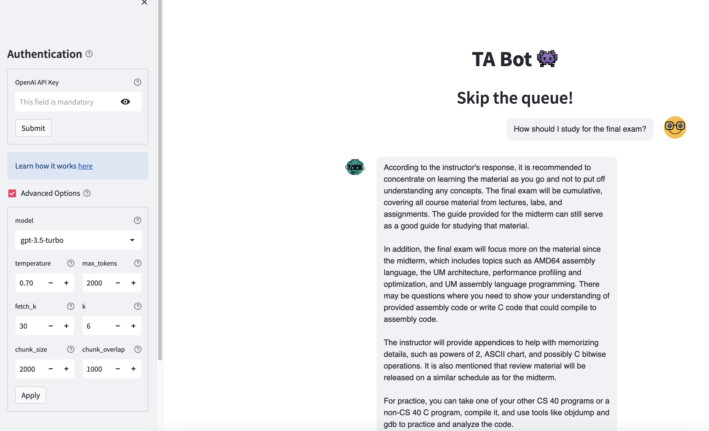

# TABot 🤖

This is an app that let's you ask questions about any data source by leveraging [embeddings](https://platform.openai.com/docs/guides/embeddings), [vector databases](https://www.activeloop.ai/), [large language models](https://platform.openai.com/docs/models/gpt-3-5) and last but not least [langchain](https://github.com/hwchase17/langchain)

## How does it work?

1. A langchain is created consisting of a LLM model (`gpt-3.5-turbo` by default) and the vector store as retriever
2. When asking questions to the app, the chain embeds the input prompt and does a similarity search of in the vector store and uses the best results as context for the LLM to generate an appropriate response
3. Finally the chat history is cached locally to enable a [ChatGPT](https://chat.openai.com/) like Q&A conversation

## Road Map:
1. Retrieve links
2.
## TODO LIST
If you like to contribute, feel free to grab any task

1. Would like to change iter_all_posts function so it downloads questions that haven't been stored yet
    - Perhaps we could use a snowflake or mongoDB database to store docs that are also in the vector
        database. This way, we could see what's in the vector database and what 
2. Add a linter
3. Add a different template for posts that are notes
4. Add weights to documents
5. Some answers are formatted in html or md, make them into plain text when downloading
6. Need to make embedded links accessible
7. Add more documents:
    - B&O textbook
    - Slide decks
    - Specs
    - Random stuff from the calendar
8. Would be cool if you could select which homework you're working on, kind of like selecting a folder
    for a Piazza post...
9. Ensure that there are no contradictory answers:
    - Make a training dataset of questions
    - Ensure the answers are correct
    - Negate all of the questions
    - See what responses LLM produces
10. Answers need to have links to documentation
    - I can incorporate this relatively easily
11. Obviously this was forked from someone else's repo, so would like to remove all the unnecessary 
    stuff that's in here
12. Update the .gitignore file
    - I'm not sure what I meant exactly, but we shouldn't be uploading unnecessary/secret stuff once
        it's public
13. Add different data sources for CS40, CS11, etc. 
    - Change the "Data source text_embeddings is ready to go with model gpt-3.5-turbo!" thing that pops up?
        to also say that you're authenticated or something
14. Add a dark mode...
15. Need basic information about the course too! 
    - Professor, language taught in, etc.
        - There could just be 1 document for that. Could grab from SIS?
        - Could grab through using requests library with course website?
16. Find the textbooks on the internet and load them into the database too. It'd be really helpful if when
    a student asked a specific question they got feedback on the question.
17. This warning pops up sometimes, would like to fix:
        "/Users/john.eastman/Desktop/Personal/TABot/piazza_data.py:28: MarkupResemblesLocatorWarning: The input looks more like a filename than markup. You may want to open this file and pass the filehandle into Beautiful Soup.
        soup = BeautifulSoup(html_text, 'lxml')"
18. A "neither appeared" popped up, need to figure out what post that is. I think it's a poll
19. Need to figure out optimal time to sleep for Piazza API, also is there a way to go rly fast but then
    when error pops up, we stop and wait then continue?
20. Implement boosted retrieval/ping LLM again with boosted retreival if response is bad.
21. We could have students label their answer in 1 of a few different ways, then
        use that as training data for the audit model.
22. https://python.langchain.com/docs/modules/data_connection/retrievers/parent_document_retriever
23. Figure out why the prompt template is getting printed so often.

## To Run Locally or to develop:
1. Run `poetry install`
    - Optional (recommended) add the python interpreter as its location'll be displayed as the first line
        after poetry install